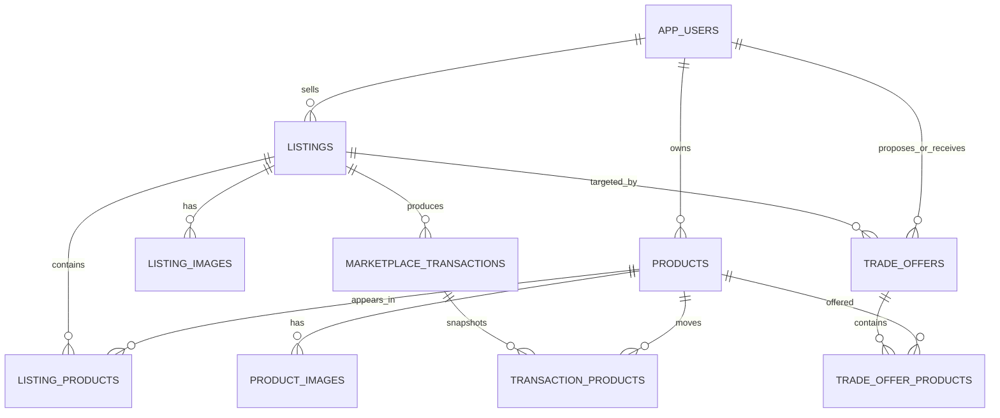

# Database and trade architecture

The supplied dbdiagram already contains the correct central relationship:
`Listing_Product` makes `Product ↔ Listing` many-to-many. The migration in
[`001_marketplace_core.sql`](../database/migrations/001_marketplace_core.sql)
keeps that model and adds the constraints and workflows needed to make it safe.

## Core interpretation

- A `products` row is **one physical copy**, not a generic manga title.
- A product may belong to more than one listing at the same time. For example,
  volume 4 can have its own single listing and also be part of a volumes 1–7
  collection listing.
- `listing_products.removed_at` retires a membership without deleting history.
- A `single` listing must have exactly one active product.
- A `collection` listing must have at least two active products.
- A sale or trade transfers ownership of the physical product. A trigger then
  retires that product from every listing that still references it.

## When an individual product sells

The API calls `finalize_sale(listing_id, buyer_id, amount, currency, method)`.
The database performs the following in one transaction:

1. Locks the listing and all active products in it.
2. Confirms the listing is active, sale-enabled, and fully available.
3. Creates the completed transaction and immutable product snapshots.
4. Changes each product's owner to the buyer and sets it to `unlisted`.
5. The ownership trigger marks every related `listing_products` row removed.
6. A single listing closes when it has zero products.
7. A collection listing closes when it falls below two products; otherwise it
   stays live with its remaining physical copies.

The original product ID and transaction history remain available for
provenance, reviews, disputes, and a future relisting by the new owner.

## Trading

A `trade_offer` targets an active listing and names the two members. Its child
rows identify products on each side:

- `side = proposer`: products currently owned by the person making the offer.
- `side = recipient`: products from the listing being requested.
- `cash_adjustment`: optional amount used to balance unequal values.

The recipient accepts through `accept_trade_offer(offer_id, recipient_id)`.
That function:

1. Locks the offer and every product in a deterministic order.
2. Rechecks ownership and availability for both sides.
3. Confirms requested recipient products still belong to the target listing.
4. Writes a completed trade transaction with from/to snapshots.
5. Swaps product ownership.
6. Retires the traded products from every old listing.
7. Expires competing pending offers that reference any moved product.

This is intentionally atomic: either all products move and all listings update,
or none of them do.

## Backend server boundary

The SQL is ready for PostgreSQL 15+ and fits a Supabase, Neon, Railway, Render,
or self-hosted PostgreSQL backend. The application server should expose
authenticated commands rather than allowing clients to update ownership,
listing status, or trade status directly:

- `POST /listings` creates a draft and its product memberships.
- `POST /listings/:id/publish` calls `activate_listing`.
- `POST /listings/:id/purchase` processes payment, then calls `finalize_sale`.
- `POST /trade-offers` creates a pending offer and both sets of products.
- `POST /trade-offers/:id/accept` calls `accept_trade_offer`.
- `POST /trade-offers/:id/reject` updates only an offer owned by the recipient.

Payment authorization and shipping labels should remain outside the database.
The final database function should run only after payment authorization, while
payment capture should happen after the function succeeds.
